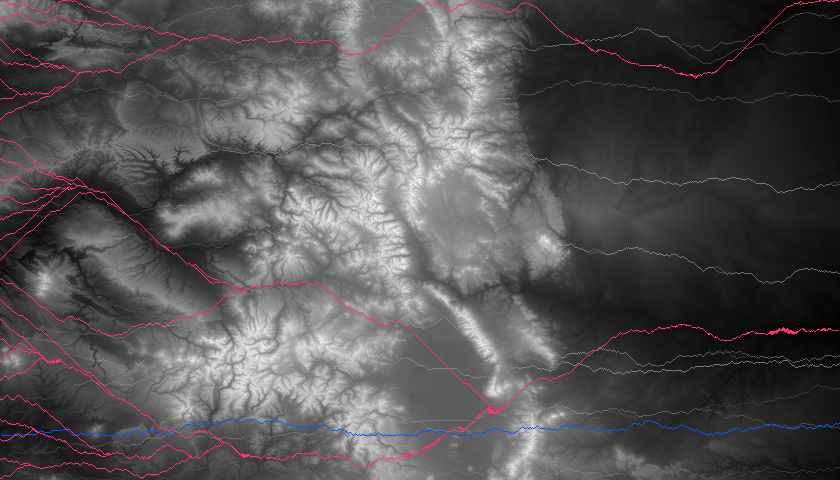

## Traversing the Colorado Mountains using Djikstra's Shortest Path Algorithm
#### By: Dustin Stewart
### NOTE: I added these files to Github [here](https://github.com/dustin-stew/MountainTraversalUsingDjikstraAlgorithm) if that's easier.
### Structure
[Driver.java](Driver.java) - This  is the main driver of the project  
[MapDataDrawer.java](MapDataDrawer.java) - draws the routes on the topography map  
[Djikstra.java](Djikstra.java) - uses Djikstra's shortest path algorithm to calculate the optimal routes  
[DrawingPanel.java](DrawingPanel.java)  - Helper class for drawing

### Challenges
* **todo** - todo
### Test Cases

