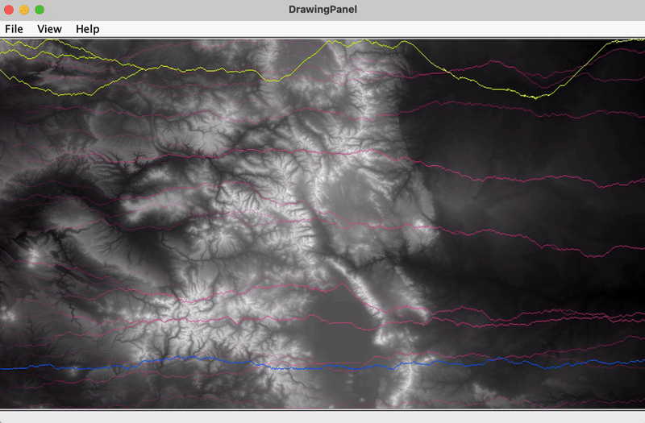

## Traversing the Colorado Mountains using Dijkstra's Shortest Path Algorithm
#### Author: Dustin Stewart
### NOTE: I added these files to Github [here](https://github.com/dustin-stew/MountainTraversalUsingDijkstraAlgorithm) if that's easier.

### Structure
[Driver.java](Driver.java) - This  is the main driver of the project  
#### *For Dijkstra's shortest path*:
Enter y to run and then you can do one of four things:
1. **Press enter twice (no values for start and end)**
   * **Draws**: best path from best greedy starting point to optimal end point
   * **Calculates**: all shortest paths between best greedy starting point and all eastern points
2. **Enter start value but no end**
   * **Draws**: The optimal path between supplied start row and the eastern point with the shortest path overall
   * **Calculates**: all shortest paths between provided starting point and all eastern points
3. **Enter end value but no start** 
   * **Draws**: the best path from the best greedy start point to the provided end value
   * **Calculates**: all shortest paths between best greedy starting point and all eastern points
4. **Enter both start and end values** 
   * **Draws**: draws the shortest path between the start and end values provided
   * **Calculates**: all shortest paths between provided start and all eastern points  

[MapDataDrawer.java](MapDataDrawer.java) - draws the routes on the topography map  
[dijkstra.java](dijkstra.java) - uses Dijkstra's shortest path algorithm to calculate the optimal routes.  
[DrawingPanel.java](DrawingPanel.java)  - Helper class for drawing

### Challenges
* **`if else` statement logic** - Trying to structure the if else is difficult for me - somtimes it just take some trial and error
* **Borders of map** - if the path was on the border it needed to ignore the option to go over the border - I ended up just setting that option equal to the forward option so it would never win
* **Dijkstra's shortest path** - needed to figure out how to reverse from the shortest path endpoint to get the whole path.
### Test Cases
No test cases for the first part, but the below values will draw the shortest path from each 20th row to the eastern point with the shortest path.  

y  
0  
d  
y  
20  
d  
y  
40  
d  
y  
60  
d  
y  
80  
d  
y  
100  
d  
y  
120  
d  
y  
140  
d  
y  
160  
d  
y  
180  
d  
y  
200  
d  
y  
220  
d  
y  
240  
d  
y  
260  
d  
y  
280  
d  
y  
300  
d  
y  
320  
d  
y  
340  
d  
y  
360  
d  
y  
380  
d  
y  
400  
d  
y  
420  
d  
y  
440  
d  
y  
460  
d  
y  
479  
d  

